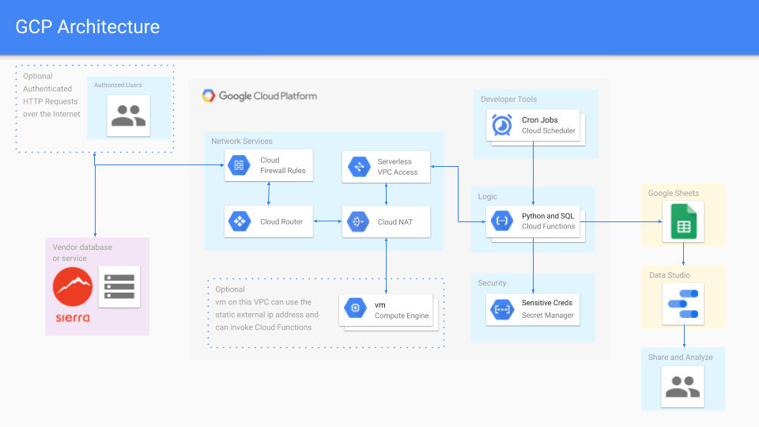

# sql-to-sheet
This Google Cloud Function appends SQL results to a Google Sheet

# Set Up Your VPC Network
1. [Create a VPC network](https://cloud.google.com/vpc/docs/using-vpc#creating_networks) and configure its firewall rules according to your needs
2. [Configure serverless VPC access](https://cloud.google.com/vpc/docs/configure-serverless-vpc-access) and create a connector

# Create and Configure Your Cloud Function
1. [Create an HTTP Cloud Function](https://cloud.google.com/functions/docs/writing)
2. [Configure the function's ingress settings](https://cloud.google.com/functions/docs/networking/network-settings#ingress_settings) to allow all traffic or internal traffic only if you want a private function
3. [Configure the function's egress settings](https://cloud.google.com/functions/docs/networking/network-settings#egress_settings) to route all traffic through the connector
4. [Deploy your function](https://cloud.google.com/functions/docs/deploying)

**At this point all traffic originating from your function will follow your VPC firewall rules. But wait, now your function is unable to access the public internet until you configure Cloud NAT.**

# Set Up Your Cloud Router and NAT 
1. [Setup Cloud NAT](https://cloud.google.com/nat/docs/using-nat) and [specify a static ip address](https://cloud.google.com/nat/docs/using-nat#specify_ip_addresses_for_nat)

**Congratulations! Now your function's egress traffic originates from your static ip address.**

# Store Your Secrets Securely
1. [Create and access secrets](https://cloud.google.com/secret-manager/docs/creating-and-accessing-secrets) such as a database connection string or the private key of a service account
2. Store the resource ids of your secrets as environment variables so you can access them at run time

# Create and Configure Your Cron Jobs with Cloud Scheduler
1. [Define a schedule](https://cloud.google.com/scheduler/docs/creating) using a unix-cron configuration string
2. Specify the target as the HTTP endpoint of your Cloud Function

# Pricing
* Cloud Functions, Serverless VPC Access, Cloud NAT, Secret Manager and Cloud Scheduler are paid products that require biling to use.
* [The first 2 million Cloud Function invocations per month are free](https://cloud.google.com/functions/pricing) *Phew*
* Serverless VPC Access and Cloud NAT charges are based on the ammount of traffic that is processed.
* [Serverless VPC Access Pricing](https://cloud.google.com/vpc/docs/configure-serverless-vpc-access#pricing)
* [Cloud NAT Pricing](https://cloud.google.com/nat/pricing)
* [Secret Manager](https://cloud.google.com/secret-manager/pricing) charges are based on how many secrets you keep and how many times per month they are accessed
* [Cloud Scheduler](https://cloud.google.com/scheduler/pricing) offers 3 jobs per month free and charges $0.10 per job per month after that
